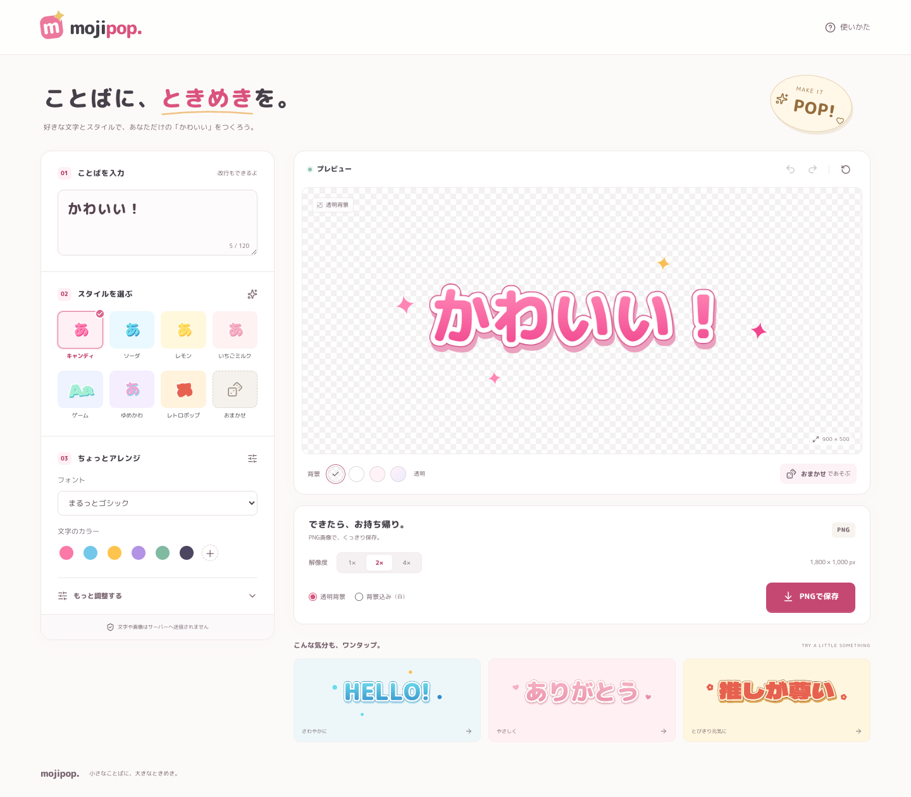
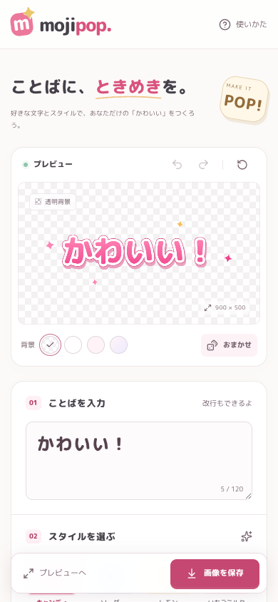

# mojipop

好きなことばを、ポップでかわいい文字画像にするブラウザアプリ。
React / TypeScript / Vite と Canvas 2D で作成しています。バックエンドやAPIキーは不要です。

## プレビュー



<details>
<summary>スマートフォンでの表示</summary>



</details>

## 起動

```sh
git clone https://github.com/perl-0815/mojipop.git
cd mojipop
npm install
npm run dev
```

ターミナルに表示されるURLを開いてください。

```sh
npm run build    # 型チェック + dist/ へ本番ビルド
npm run preview  # ビルドしたアプリをローカルで確認
```

Node.js 22.12以降を推奨。開発時はNode.js 26.5で確認しています。
本番ビルドは静的ファイルだけなので、任意の静的ホスティングで配信できます。

## できること

- 日本語・英数字・記号・改行を含む120文字までの入力
- キャンディ / ソーダ / レモン / いちごミルク / ゲーム / ゆめかわ / レトロポップ
- 丸ゴシック・太いゴシック・手書きの3フォント、文字サイズ・太さ・字間・行間
- 単色・2色グラデーション、方向の変更
- 一重・二重縁取り、くっきり・ぼかし影、3D押し出し
- キラキラ・星・ハート・丸・花・音符、装飾量の変更
- 透明・白・単色・グラデーション背景
- 配色ルールに沿ったおまかせ生成、元に戻す・やり直す
- 1× / 2× / 4× のPNG保存、透明背景 / 背景込み
- スマートフォンではプレビューを先頭に表示し、保存・プレビューへ移動を固定表示

「もっと調整する」の中に詳細設定をまとめています。最初は完成例が表示されるため、そのままPNGを保存することもできます。

## 描画と保存

プレビューとPNGの両方を `src/render.ts` の同じCanvas描画処理で生成します。
実際に入力された文字のフォント読み込みを待ってから描画・保存するため、日本語のフォントが一部だけ未読込の状態で書き出されるのを防ぎます。

論理画像は最小900×500、最大辺2048px。長い行は自動的に折り返し、入力された改行も保持します。
サイズ上限を超えるテキストは全体を縮小して収めます。影・装飾も含めた余白を確保します。
PNGはメモリ消費を抑えるため最大3200万画素までで、大きい画像の4×は自動調整されます。保存欄には実際に出力するピクセル寸法を表示します。

透明背景のチェック模様は画面表示専用で、PNGには含まれません。
背景が透明のまま「背景込み」を選んだ場合は白背景になります。

フォントファイルはアプリに同梱し、外部のフォント配信サーバーには依存しません。
文字や画像をサーバーへ送信する機能、解析・追跡機能、アカウントはありません。
作成内容はメモリ上だけで保持するため、再読み込みすると初期状態に戻ります。

## ファイル構成

```text
src/App.tsx       編集画面・履歴・ダウンロード
src/render.ts    共通のCanvas描画・フォント読込・PNG生成
src/presets.ts   プリセットとランダム生成の配色ルール
src/types.ts     編集データ型・フォントの対応
src/styles.css  レスポンシブUI
tests/          実ブラウザでの操作・PNG検証
public/licenses/ フォントライセンス
```

## 検証

```sh
npx playwright install chromium  # 初回のみ
npm test
```

テストは専用の開発サーバー（127.0.0.1:5200）を起動します。
プリセット、フォント、詳細設定、ランダム生成、履歴、空入力、PNGの実ダウンロード、透過、解像度、画像一致、モバイル幅、ヘルプのキーボード操作を確認します。

Chromiumで動作確認済み。Safari / Firefoxおよび実機の保存先UIは未確認です。

## フォントと参照資料

同梱フォントは M PLUS Rounded 1c、Dela Gothic One、Yomogi。各ライセンスは `public/licenses/` にあります。

- [Canvas 2D API — MDN](https://developer.mozilla.org/en-US/docs/Web/API/CanvasRenderingContext2D)
- [Vite Getting Started](https://vite.dev/guide/)
